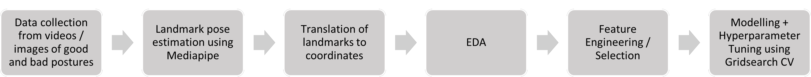

#  Posture Analysis

## Introduction on Posture:

Proper posture refers to the correct alignment of individual body parts in relation to adjacent segments and the entire body [1]. Maintaining good posture is crucial for overall health [2]. It ensures a balanced position of the musculoskeletal system, minimizing stress and strain on the body. Incorrect posture can lead to various musculoskeletal issues such as pain, impaired proprioception, imbalanced muscle activity, abnormal pressure on joints and ligaments, fatigue, and an increased risk of falling [3].

1: https://doi.org/10.1590/S1807-59322010000700005  
2: https://doi.org/10.1186/1471-2474-6-35  
3: https://link.springer.com/article/10.1007/s11845-021-02827-5#Sec1

## Problem Statement:

In the pursuit of a healthy lifestyle, many individuals turn to running or walking as a form of exercise. Based on a US National Health Survey, walking and running ranked as the two most popular physical activities [4]. However, poor running or walking posture can lead to unnecessary stress and strain on muscles and joints, and hindered progress towards fitness goals. Poor posture can cause pain and injuries in up to 79% of adults, with low back pain affecting 25% of adults every year [5]. Poor posture may stem from various factors, such as fatigue, lack of awareness, or even ill-fitted running shoes. Understanding and correcting posture can be the key to preventing injuries and optimizing performance. Traditional methods of assessing posture often prove to be costly and inaccessible for many.

**Existing methods**: Visiting a chiropractor for posture assessment - often costly and inaccessible.  
**Gap in market**: no existing apps that track posture analysis.  

4: https://www.ncbi.nlm.nih.gov/pmc/articles/PMC4487906/  
5: https://www.lompocvmc.com/blogs/2021/april/importance-of-good-posture/?locale=en   
 

## Objective:

This project aims to empower individuals to improve their running / walking postures by leveraging computer vision to develop a classification model app that identifies good or bad postures.. The model will be trained on a dataset of images and videos of good and poor postures. Once trained, the model will be deployed via the Streamlit app, and can ingest in a image / video to identify people with poor posture in real time.

## Project Workflow:

  

 Mediapipe Landmark Poses:  
  

## Conclusion:
#### Link to Streamlit app repo: [Click Here](https://github.com/tiffanytgr/posture-analysis-app) 
#### Example output of app deployed on streamlit: 

### Features:
- Empowers users to check if posture is good or bad based on the trained ML model, using the features like angles between body landmarks
- There will be a "beep" sound if a bad posture is detected

### Use Cases / Gap in Market:
- Public exercise areas like parks / stadiums to remind people to have good posture
- In schools, can be used during Physical Education classes to ensure students have good postures
- Assist in teleconsultation with doctors / chiropractors
- Mobile app for individuals to monitor their own postures

### Future Work:
- Deploy it to a mobile app
- Prescriptive messages on how to improve posture
- Detect specific types of bad posture / medical conditions such as overarching or slouching 
